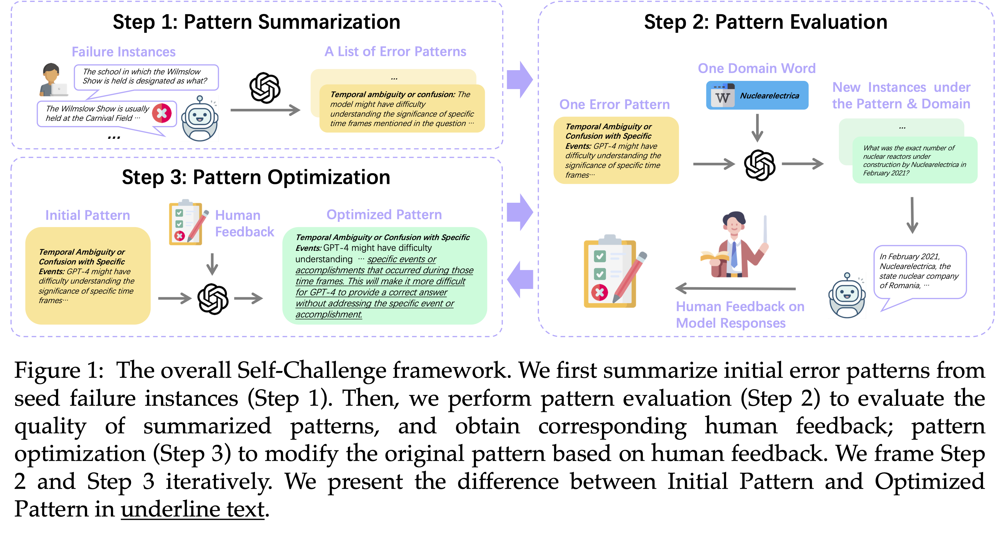

# See What LLMs Cannot Answer: A Self-Challenge Framework for Uncovering LLM Weaknesses

We introduce the Self-Challenge framework. 
As shown in Self-Challenge framework provides an evaluation protocol that asks LLMs to find their own limitations from the errors they make, with the help of human-in-the-loop.


<p align="center">
    
</p>

Applying this framework to GPT-4, we discover 8 error patterns from 189 instances and then build a benchmark, SC-G4, consisting of 1,835 instances generated by GPT-4 using these patterns, with human-annotated gold responses. 

You can directly download the data from this [fold](https://github.com/cylnlp/Self-Challenge-GPT4/SC-G4.json).

This work is accepted by COLM 2024. If you find our paper interesting, please kindly cite our paper.
<!-- ```
@inproceedings{chen-etal-2021-dialogsum,
    title = "See What LLMs Cannot Answer: A Self-Challenge Framework for Uncovering LLM Weaknesses",
    author = "Chen, Yulong  and
      Liu, Yang  and
      Chen, Liang  and
      Zhang, Yue",
    booktitle = "Findings of the Association for Computational Linguistics: ACL-IJCNLP 2021",
    month = aug,
    year = "2021",
    address = "Online",
    publisher = "Association for Computational Linguistics",
    url = "https://aclanthology.org/2021.findings-acl.449",
    doi = "10.18653/v1/2021.findings-acl.449",
    pages = "5062--5074",
}
```

[DialogSum Challenge](https://aclanthology.org/2021.inlg-1.33.pdf) is a shared task at [INLG 2022](https://inlgmeeting.github.io/index.html). Check the [task website](https://cylnlp.github.io/dialogsum-challenge/) and [shared task report](https://arxiv.org/pdf/2208.03898.pdf).

This dataset is under [CC BY-NC-SA 4.0](https://creativecommons.org/licenses/by-nc-sa/4.0/) license. You may not use it for commercial use without permission. -->
